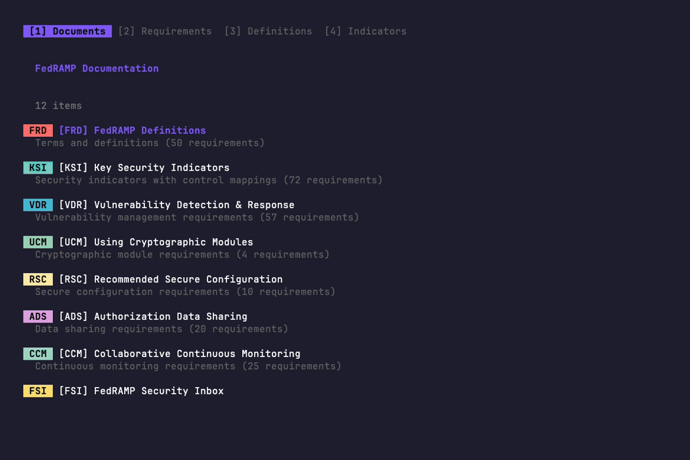

# FedRAMP TUI

A terminal user interface for browsing FedRAMP documentation.

## Demo



## Features

- **Document Navigator**: Browse all 12 FedRAMP document categories
- **Requirements Search**: Search and filter requirements across all documents
- **Definitions Lookup**: Quick access to FedRAMP terminology
- **Key Security Indicators**: View KSI themes with SP 800-53 control mappings

## Installation

### Homebrew (macOS/Linux)

```bash
brew install ethanolivertroy/sectools/fedramp
```

### Scoop (Windows)

```powershell
scoop bucket add sectools https://github.com/ethanolivertroy/scoop-sectools
scoop install fedramp
```

### Download Binary

Download from [Releases](https://github.com/ethanolivertroy/fedramp-tui/releases):

| Platform | Binary |
|----------|--------|
| macOS (Apple Silicon) | `fedramp-darwin-arm64` |
| macOS (Intel) | `fedramp-darwin-amd64` |
| Linux (x64) | `fedramp-linux-amd64` |
| Linux (ARM64) | `fedramp-linux-arm64` |
| Windows (x64) | `fedramp-windows-amd64.exe` |

### Go Install

```bash
go install github.com/ethanolivertroy/fedramp-tui@latest
```

### Build from Source

```bash
git clone https://github.com/ethanolivertroy/fedramp-tui.git
cd fedramp-tui
go build -o fedramp .
```

## Usage

```bash
./fedramp-tui
```

### Command Line Options

| Flag | Description |
|------|-------------|
| `--refresh` | Force fresh fetch from GitHub, ignoring cache |

### Caching

Data is cached locally at `~/.cache/fedramp-tui/` with a 24-hour TTL. On subsequent runs, the TUI loads instantly from cache. Use `--refresh` to force a fresh fetch.

### Key Bindings

| Key | Action |
|-----|--------|
| `1` | View Documents |
| `2` | View Requirements |
| `3` | View Definitions |
| `4` | View Key Security Indicators |
| `j/k` or `↑/↓` | Navigate list |
| `Enter` | View details |
| `Esc` or `Backspace` | Go back |
| `/` | Filter/search |
| `m` | Filter MUST requirements (Requirements view) |
| `s` | Filter SHOULD requirements (Requirements view) |
| `x` | Cycle affects filter: All → Providers → Agencies → Assessors → FedRAMP (Requirements view) |
| `f` | Clear filters (Requirements view) |
| `q` | Quit |

## Data Sources

Data is fetched directly from the [FedRAMP/docs](https://github.com/FedRAMP/docs) GitHub repository.

### Documents

| Code | Name |
|------|------|
| FRD | FedRAMP Definitions |
| KSI | Key Security Indicators |
| VDR | Vulnerability Detection & Response |
| UCM | Using Cryptographic Modules |
| RSC | Recommended Secure Configuration |
| ADS | Authorization Data Sharing |
| CCM | Collaborative Continuous Monitoring |
| FSI | FedRAMP Security Inbox |
| ICP | Incident Communications Procedures |
| MAS | Minimum Assessment Scope |
| PVA | Persistent Validation & Assessment |
| SCN | Significant Change Notifications |

## Acknowledgments

Built with [GoReleaser](https://goreleaser.com/) by [Carlos Becker](https://github.com/caarlos0).

## Disclaimer

This is not an official FedRAMP tool and I'm not officially associated with the GSA/FedRAMP PMO.

## License

MIT
